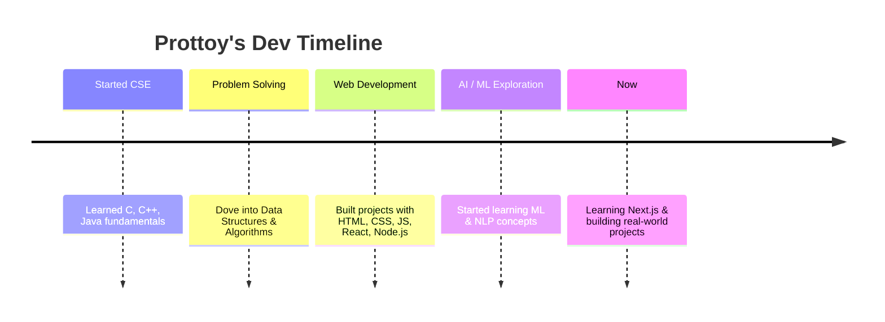

<!-- ========================= -->
<!--         BANNER            -->
<!-- ========================= -->

<p align="center">
  
</p>

<!-- ========================= -->
<!--     TYPING ANIMATION      -->
<!-- ========================= -->

<p align="center">
  <a href="#">
    
  </a>
</p>

<!-- ========================= -->
<!--       SOCIAL BADGES       -->
<!-- ========================= -->

<p align="center">
  <a href="https://github.com/prottoym">
    
  </a>
  <a href="https://www.linkedin.com/in/prottoy-modak-271419215/">
    
  </a>
  <a href="mailto:prottoymodakprottoy@gmail.com">
    
  </a>
</p>

<p align="center">
  📍 Dhaka, Bangladesh &nbsp;|&nbsp; 📧 prottoymodakprottoy@gmail.com
</p>

<p align="center">
  
</p>

<!-- ========================= -->
<!--     TERMINAL INTRO CARD   -->
<!-- ========================= -->

```bash
prottoy@dev:~$ whoami
> CSE Student | Software Engineer | AI/ML Enthusiast

prottoy@dev:~$ cat mission.txt
> Turning ideas into practical, working software — one commit at a time.

prottoy@dev:~$ ./run.sh --mode=learning --stack=web,ai,ml,dsa
> [OK] Building real-world projects to sharpen my skills...
```

---

## 👨‍💻 About Me

I'm a **Computer Science & Engineering student** with a strong interest in software development, problem solving, web technologies, Artificial Intelligence, Machine Learning, and Natural Language Processing.

I enjoy turning ideas into practical projects, learning new technologies through hands-on development, and continuously improving my programming and software engineering skills.

```yaml
name: Prottoy Modak
role: CSE Student | Software Engineer | AI/ML Enthusiast
location: Dhaka, Bangladesh
interests:
  - Software Development
  - Artificial Intelligence & Machine Learning
  - Algorithms & Problem Solving
  - Web Development
  - Natural Language Processing
currently_building: real-world projects to sharpen my skills
motto: "Learning • Building • Improving"
```

---

## 🧭 My Journey So Far



---

## 🚀 What I'm Currently Working On

<table>
<tr>
<td width="50%" valign="top">

**🔨 Building**
- Software development projects
- Practical applications of academic concepts

**🌐 Exploring**
- Modern web development (learning **Next.js**)

</td>
<td width="50%" valign="top">

**🤖 Learning**
- AI, Machine Learning & NLP
- Data Structures & Algorithms

**📖 Improving**
- Coding & problem-solving skills daily

</td>
</tr>
</table>

---

## 🛠️ Skills & Technologies

<p align="center"><b>💻 Programming Languages</b></p>
<p align="center">
  
</p>

<p align="center"><b>🌐 Web Technologies</b></p>
<p align="center">
  
</p>

<p align="center"><b>🤖 AI / ML & Data</b></p>
<p align="center">
  
</p>

<p align="center"><b>🧰 Tools & Platforms</b></p>
<p align="center">
  
</p>

---

## 📊 GitHub Stats

<p align="center">
  
  
</p>

<p align="center">
  
</p>

<p align="center">
  
</p>

---

## 🧩 Featured Projects

<p align="center">
  <a href="https://github.com/prottoym?tab=repositories">
    
    
  </a>
</p>

> 💡 *Pin your best repositories on GitHub — they'll automatically show up here once configured.*

---

## 🎯 Goals for This Year

- [ ] Master **Next.js** and build full-stack production apps
- [ ] Deepen knowledge of **Machine Learning** & **NLP**
- [ ] Solve 300+ problems across competitive programming platforms
- [ ] Contribute to open-source projects
- [ ] Build and ship at least 3 real-world portfolio projects

---

## 📫 Let's Connect

<p align="center">
  <a href="https://www.linkedin.com/in/prottoy-modak-271419215/">
    
  </a>
  <a href="mailto:prottoymodakprottoy@gmail.com">
    
  </a>
  <a href="https://github.com/prottoym">
    
  </a>
</p>

<p align="center">
  <i>"Learning • Building • Improving"</i>
</p>

<p align="center">
  
</p>

<table>
<tr>
<td width="50%" valign="top">

**🔨 Building**
- Software development projects
- Practical applications of academic concepts

**🌐 Exploring**
- Modern web development (learning **Next.js**)

</td>
<td width="50%" valign="top">

**🤖 Learning**
- AI, Machine Learning & NLP
- Data Structures & Algorithms

**📖 Improving**
- Coding & problem-solving skills daily

</td>
</tr>
</table>

---

## 🛠️ Skills & Technologies

<p align="center"><b>💻 Programming Languages</b></p>
<p align="center">
  
</p>

<p align="center"><b>🌐 Web Technologies</b></p>
<p align="center">
  
</p>

<p align="center"><b>🤖 AI / ML & Data</b></p>
<p align="center">
  
</p>

<p align="center"><b>🧰 Tools & Platforms</b></p>
<p align="center">
  
</p>

---

## 📊 GitHub Stats

<p align="center">
  
  
</p>

<p align="center">
  
</p>

<p align="center">
  
</p>

---

## 🧩 Featured Projects

<p align="center">
  <a href="https://github.com/prottoym?tab=repositories">
    
    
  </a>
</p>

> 💡 *Pin your best repositories on GitHub — they'll automatically show up here once configured.*

---

## 🎯 Goals for This Year

- [ ] Master **Next.js** and build full-stack production apps
- [ ] Deepen knowledge of **Machine Learning** & **NLP**
- [ ] Solve 300+ problems across competitive programming platforms
- [ ] Contribute to open-source projects
- [ ] Build and ship at least 3 real-world portfolio projects

---

## 📫 Let's Connect

<p align="center">
  <a href="https://www.linkedin.com/in/prottoy-modak-271419215/">
    
  </a>
  <a href="mailto:prottoymodakprottoy@gmail.com">
    
  </a>
  <a href="https://github.com/prottoym">
    
  </a>
</p>

<p align="center">
  <i>"Learning • Building • Improving"</i>
</p>

<p align="center">
  
</p>
<!-- ========================= -->
<!--         BANNER            -->
<!-- ========================= -->

<p align="center">
  
</p>

<!-- ========================= -->
<!--     TYPING ANIMATION      -->
<!-- ========================= -->

<p align="center">
  <a href="#">
    
  </a>
</p>

<!-- ========================= -->
<!--       SOCIAL BADGES       -->
<!-- ========================= -->

<p align="center">
  <a href="https://github.com/prottoym">
    
  </a>
  <a href="https://www.linkedin.com/in/prottoy-modak-271419215/">
    
  </a>
  <a href="mailto:prottoymodakprottoy@gmail.com">
    
  </a>
</p>

<p align="center">
  📍 Dhaka, Bangladesh &nbsp;|&nbsp; 📧 prottoymodakprottoy@gmail.com
</p>

<p align="center">
  
</p>

<!-- ========================= -->
<!--     TERMINAL INTRO CARD   -->
<!-- ========================= -->

```bash
prottoy@dev:~$ whoami
> CSE Student | Software Engineer | AI/ML Enthusiast

prottoy@dev:~$ cat mission.txt
> Turning ideas into practical, working software — one commit at a time.

prottoy@dev:~$ ./run.sh --mode=learning --stack=web,ai,ml,dsa
> [OK] Building real-world projects to sharpen my skills...
```

---

## 👨‍💻 About Me

I'm a **Computer Science & Engineering student** with a strong interest in software development, problem solving, web technologies, Artificial Intelligence, Machine Learning, and Natural Language Processing.

I enjoy turning ideas into practical projects, learning new technologies through hands-on development, and continuously improving my programming and software engineering skills.

```yaml
name: Prottoy Modak
role: CSE Student | Software Engineer | AI/ML Enthusiast
location: Dhaka, Bangladesh
interests:
  - Software Development
  - Artificial Intelligence & Machine Learning
  - Algorithms & Problem Solving
  - Web Development
  - Natural Language Processing
currently_building: real-world projects to sharpen my skills
motto: "Learning • Building • Improving"
```

---

## 🧭 My Journey So Far


---

## 🚀 What I'm Currently Working On

<table>
<tr>
<td width="50%" valign="top">

**🔨 Building**
- Software development projects
- Practical applications of academic concepts

**🌐 Exploring**
- Modern web development (learning **Next.js**)

</td>
<td width="50%" valign="top">

**🤖 Learning**
- AI, Machine Learning & NLP
- Data Structures & Algorithms

**📖 Improving**
- Coding & problem-solving skills daily

</td>
</tr>
</table>

---

## 🛠️ Skills & Technologies

<p align="center"><b>💻 Programming Languages</b></p>
<p align="center">
  
</p>

<p align="center"><b>🌐 Web Technologies</b></p>
<p align="center">
  
</p>

<p align="center"><b>🤖 AI / ML & Data</b></p>
<p align="center">
  
</p>

<p align="center"><b>🧰 Tools & Platforms</b></p>
<p align="center">
  
</p>

---

## 📊 GitHub Stats

<p align="center">
  
  
</p>

<p align="center">
  
</p>

<p align="center">
  
</p>

---

## 🧩 Featured Projects

<p align="center">
  <a href="https://github.com/prottoym?tab=repositories">
    
    
  </a>
</p>

> 💡 *Pin your best repositories on GitHub — they'll automatically show up here once configured.*

---

## 🎯 Goals for This Year

- [ ] Master **Next.js** and build full-stack production apps
- [ ] Deepen knowledge of **Machine Learning** & **NLP**
- [ ] Solve 300+ problems across competitive programming platforms
- [ ] Contribute to open-source projects
- [ ] Build and ship at least 3 real-world portfolio projects

---

## 📫 Let's Connect

<p align="center">
  <a href="https://www.linkedin.com/in/prottoy-modak-271419215/">
    
  </a>
  <a href="mailto:prottoymodakprottoy@gmail.com">
    
  </a>
  <a href="https://github.com/prottoym">
    
  </a>
</p>

<p align="center">
  <i>"Learning • Building • Improving"</i>
</p>

<p align="center">
  
</p>

