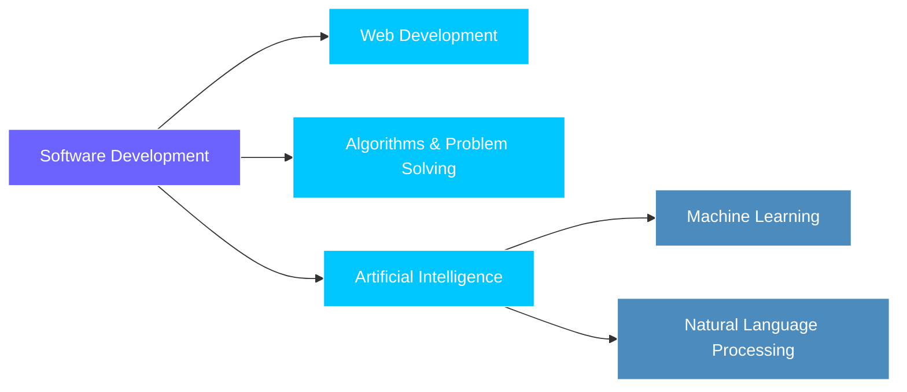

<!-- ========================= -->
<!--         BANNER            -->
<!-- ========================= -->

<p align="center">
  
</p>

<!-- ========================= -->
<!--     TYPING ANIMATION      -->
<!-- ========================= -->

<p align="center">
  <a href="#">
    
  </a>
</p>

<!-- ========================= -->
<!--       SOCIAL BADGES       -->
<!-- ========================= -->

<p align="center">
  <a href="https://github.com/prottoym">
    
  </a>
  <a href="https://www.linkedin.com/in/prottoy-modak-271419215/">
    
  </a>
  <a href="mailto:prottoymodakprottoy@gmail.com">
    
  </a>
</p>

<p align="center">
  📍 Dhaka, Bangladesh &nbsp;|&nbsp; 📧 prottoymodakprottoy@gmail.com
</p>

<p align="center">
  
</p>

---

## 👨‍💻 About Me

I'm a **Computer Science & Engineering student** with a strong interest in software development, problem solving, web technologies, Artificial Intelligence, Machine Learning, and Natural Language Processing.

I enjoy turning ideas into practical projects, learning new technologies through hands-on development, and continuously improving my programming and software engineering skills.

```yaml
name: Prottoy Modak
role: CSE Student | Software Engineer | AI/ML Enthusiast
location: Dhaka, Bangladesh
interests:
  - Software Development
  - Artificial Intelligence & Machine Learning
  - Algorithms & Problem Solving
  - Web Development
  - Natural Language Processing
currently_building: real-world projects to sharpen my skills
motto: "Learning • Building • Improving"
```

---

## 🚀 What I'm Currently Working On

<table>
<tr>
<td width="50%" valign="top">

**🔨 Building**
- Software development projects
- Practical applications of academic concepts

**🌐 Exploring**
- Modern web development (learning **Next.js**)

</td>
<td width="50%" valign="top">

**🤖 Learning**
- AI, Machine Learning & NLP
- Data Structures & Algorithms

**📖 Improving**
- Coding & problem-solving skills daily

</td>
</tr>
</table>

---

## 🛠️ Skills & Technologies

<p align="center"><b>💻 Programming Languages</b></p>
<p align="center">
  
</p>

<p align="center"><b>🌐 Web Technologies</b></p>
<p align="center">
  
</p>

<p align="center"><b>🤖 AI / ML & Data</b></p>
<p align="center">
  
</p>

<p align="center"><b>🗄️ Database & Tools</b></p>
<p align="center">
  
</p>

---

## ⭐ Featured Projects

<table>
<tr>
<td width="50%">

### 🔹 Algorithm Visualizer
An interactive project for visualizing algorithms and making algorithmic concepts easier to understand through visual demonstrations.

**Tech Stack:** `JavaScript` `HTML` `CSS`

🔗 [View Repository](https://github.com/prottoym/Algorithm-Visualizer)

</td>
<td width="50%">

### 🔹 Vehicle Management System
A software-based system for managing vehicle-related information and operations.

**Tech Stack:** *C*

🔗  [View Repository](https://github.com/prottoym/-Vehicle-Management-System-)

</td>
</tr>
</table>

---

## 📌 My Development Interests



> 💡 If Mermaid diagrams don't render on your GitHub profile, replace this block with the original text-tree version.

---

## 🌱 Currently Learning

<p align="center">


</p>

---

## 📊 GitHub Statistics

<p align="center">
  
  
</p>

<p align="center">
  
</p>

---

## 📈 Contribution Graph

<p align="center">
  
</p>

---
## 🤝 Connect With Me

<p align="center">
<a href="https://github.com/prottoym">
  
</a>
<a href="https://www.linkedin.com/in/prottoy-modak-271419215/">
  
</a>
<a href="mailto:prottoymodakprottoy@gmail.com">
  
</a>
</p>

---

## 💡 My Goal

> To continuously learn, build meaningful projects, and grow as a software engineer while exploring the possibilities of AI and modern technologies.

---

<p align="center">
  <strong>Thanks for visiting my profile! 🚀</strong>
</p>

<p align="center">
  <i>Learning • Building • Improving</i>
</p>

<!-- ========================= -->
<!--          FOOTER            -->
<!-- ========================= -->

<p align="center">
  
</p>
